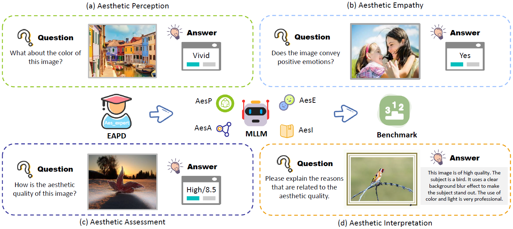

  <h1>AesBench </h1>    

_Can your MLLM understand the highly abstract image aesthetics like humans? Come and test on AesBench !_
    
 <div>
    <a href="https://aesbench.github.io/"></a>
    <a href="https://arxiv.org/abs/2401.08276"></a>
    <a href="https://huggingface.co/datasets/qyuan/EAPD_release"></a>
    <a href="https://github.com/yipoh/AesBench/tree/main/data_release"></a>
   <a href="https://aesbench.github.io/"></a>
</div>


<h5> If you like this work, please give us a star ⭐ on GitHub.  </h2>
    

<h1>Introduction</h1> 
</div>

 <br>

</h5>
</p> 
<p align="center">
    
<p>

<p align="justify">Multimodal Large Language Models (MLLMs) are undergoing flourishing development, promoting human-machine interaction and collaboration in daily life. However, their capacities for understanding image aesthetics largely remain unexplored. This may impede the applications of advanced MLLMs in real-world scenarios, such as art design and image generation. To address this dilemma, we introduce  <strong>AesBench</strong>, <strong>an expert benchmark to systematically evaluate the aesthetic understanding capacities of MLLMs</strong>. In this benchmark, high-quality annotations are first collected from aesthetic experts, based on which an aesthetics understanding benchmark dataset is built. In addition, we design a set of integrative criteria to evaluate MLLMs from four shallow-to-deep perspectives, including perception (AesP), empathy (AesE), assessment (AesA), and interpretation (AesI). We hope this work can encourage the community to delve into more profound investigations of the yet untapped potential of MLLMs in image aesthetics understanding.</p>


## News
- Leaderboard is now accessible at [Homepage](https://aesbench.github.io/). 🔥🔥🔥
- We have integrated [AesBench](https://aesbench.github.io/) to the evaluation toolkit [VLMEvalKit](https://github.com/open-compass/VLMEvalKit), providing a highly convenient testing solution! 🔥🔥🔥
- Database of AesBench now support [Huggingface](https://huggingface.co/datasets/qyuan/EAPD_release)! 🤗🤗🤗
- We have released the Evaluation Database and Codes of AesBench! Check [Here](https://github.com/yipoh/AesBench/tree/main/data_release) for more details.  🚩🚩🚩


## Leaderboard Update

[**AesBench Leaderboard**](https://aesbench.github.io/) is continuously being updated.

- **Supported closed-source commercial models**

| [**GPT-4v**](https://platform.openai.com/docs/guides/vision) | [**GPT-4o**](https://openai.com/index/hello-gpt-4o/) | [**Gemini-1.0-Pro**](https://platform.openai.com/docs/guides/vision) | [**Claude3-Opus**](https://www.anthropic.com/news/claude-3-family) | **BlueImage-GPT** | 

- **Supported open-source models**

| [**MiniCPM-L3-2.5**](https://github.com/OpenBMB/MiniCPM-V) | [**Q-Instruct**](https://q-future.github.io/Q-Instruct/) | [**InstructBLIP**](https://huggingface.co/Salesforce/instructblip-vicuna-7b) | [**MiniGPT-4**](https://github.com/Vision-CAIR/MiniGPT-4) | [**MiniGPT-v2**](https://github.com/Vision-CAIR/MiniGPT-4) |

| [**IDEFICS_Instruct**](https://huggingface.co/HuggingFaceM4/idefics-9b-instruct) | [**GLM**](https://github.com/THUDM/GLM) | [**Otter**](https://github.com/Luodian/Otter) | [**TinyGPT-v**](https://github.com/DLYuanGod/TinyGPT-V) | [**Qwen-VL**](https://github.com/QwenLM/Qwen-VL) |

| [**LLaVA**](https://github.com/haotian-liu/LLaVA/) | [**LLaVA-1.5**](https://github.com/haotian-liu/LLaVA/) | [**mPLUG-Owl2**](https://github.com/X-PLUG/mPLUG-Owl/) | [**ShareGPT4V**](https://github.com/InternLM/InternLM-XComposer/tree/main/projects/ShareGPT4V) | [**SPHINX-MoE**](https://github.com/Alpha-VLLM/LLaMA2-Accessory) | 

📌 **TO DO**
- ✅ BlueImage-GPT
- [ ] [**LLaVA-1.6**](https://github.com/haotian-liu/LLaVA/)
- [ ] [**OmniLMM-12B**](https://huggingface.co/openbmb/OmniLMM-12B/tree/main)

**Any models that you would like to test on AesBench, please contact us.**

## Submission Guideline


- Please see our [release](https://github.com/yipoh/AesBench/tree/main/data_release) for details.


## Acknowledgement
We sincerely thank the 32 aesthetic experts who participated in the subjective experiments. Their rich aesthetic experience and responsible attitude make the benchmark results more reliable. We highlight partial contributors as follows:

>  **Wei Liu (educator), Xin Liu (researcher), Luxia Chen (educator), Tianjiao Gu (educator), Dahai Tian (educator), Ziyan Ou (art student)**

We extend our heartfelt thanks to our team members for their invaluable assistance in collecting data and deploying the MLLMs. We highlight partial collaborators as follows:
> **Zhichao Duan, Pangu Xie, Xinrui Xu, Yanxin Shi**


## Citation

If you find our work interesting, please feel free to cite our paper:

```bibtex
@article{AesBench,
    title={AesBench: An Expert Benchmark for Multimodal Large Language Models on Image Aesthetics Perception},
    author={Huang, Yipo and Yuan, Quan and Sheng, Xiangfei and Yang, Zhichao and Wu, Haoning and Chen, Pengfei and Yang, Yuzhe and Li, Leida and Lin, Weisi},
   journal={arXiv preprint arXiv:2401.08276},
    year={2024},
}
```
